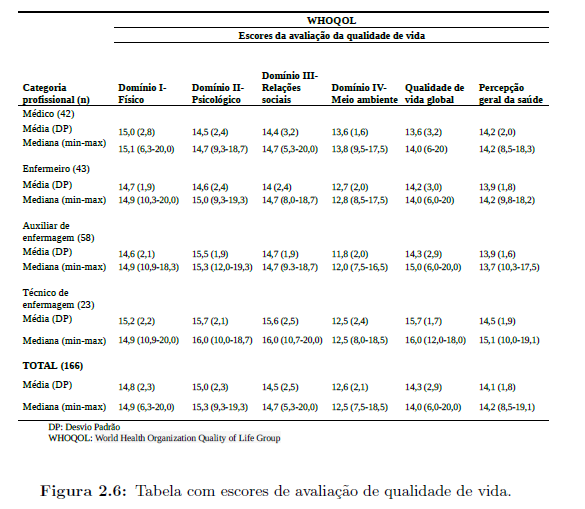
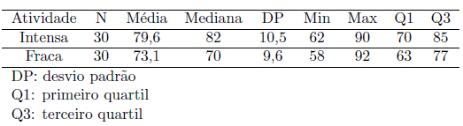

```{r setup, include=FALSE}
knitr::opts_chunk$set(echo = TRUE)
```

# Lista 1 - MAE0217 2022.1

Integrantes:

-   Lucas Toshio Loschner Fujiwara - 10737049

-   Cainã Setti Galante - 10737115

-   Daniel B. Reis - 7257437

## Cap. 2 - Ex. 2

### Enunciado

A Figura 2.6 foi extraída de um estudo sobre atitudes de profissionais de saúde com relação a cuidados com infecção hospitalar. Critique-a e reformule-a para facilitar sua leitura, lembrando que a comparação de maior interesse é entre as diferentes categorias profissionais.



### Resposta

## Cap. 2 - Ex. 8

### Enunciado

A planilha disponível no arquivo `cidades` contém informações demográficas de 3554 municípios brasileiros.

a.  Importe-a para permitir a análise por meio do *software* R, indicando os problemas encontrados nesse processo além de sua solução.

b.  Use o comando `summary` para obter um resumo das variáveis do arquivo.

c.  Classifique cada variável como numérica ou alfanumérica e indique o número de observações omissas de cada uma delas.

### Resposta

## Cap. 3 - Ex. 4

### Enunciado

Considere as variáveis `Peso` e `Altura` de homens do conjunto de dados `rehabcardio`. Determine o número de classes para os historogramas correspondentes por meio de (3.26) e (3.27) e construa-os.

### Resposta

## Cap. 3 - Ex. 5

### Enunciado

Construa gráficos ramo-e-folhas e *boxplot* para os dados do Exercício 4.

### Resposta

## Cap. 3 - Ex. 6

### Enunciado

Transforme os dados do Exercício 4 por meio de (3.23) com *p* = 0,1/4,1/3,1/2,3/4 e escolha a melhor alternativa de acordo com a medida $d_p$ dada em 3.24.

### Resposta

## Cap. 3 - Ex. 13

### Enunciado

Os dados encontrados no arquivo `esforco` são provenientes de um estudo sobre teste de esforço cardiopulmonar em pacientes com insuficiência cardíaca. As variáveis medidas durantes a realização do teste foram observadas em quatro momentos distintos: repouso (REP), limiar anaeróbio (LAN), ponto de compensação respiratório (PCR) e pico (PICO). As demais variáveis são referentes às características demográficas e clínicas dos pacientes foram registradas uma única vez.

a.  Descreva a distribuição da variável consumo do oxigênio (VO2) em cada um dos quatro momentos de avaliação utilizando medidas resumo (mínimo, máximo, quartis, mediana, média, desvio padrão, etc.), *boxplots* e histogramas. Você identifica algum paciente com valores de consumo de oxigênio discrepantes? Interprete os resultados.

b.  Descreva a distribuição da classe funcional NYHA por meio de uma tabela de frequências. Utilize um método gráfico para representar essa tabela.

### Resposta

## Cap. 3 - Ex. 17

### Enunciado

Considere o seguinte resumo descritivo da pulsação de estudantes com atividade física intensa e fraca:



Indique se as seguintes afirmações estão corretas, justificando as sua respostas:

a.  5% e 50% dos estudantes com atividade física intensa e fraca, respectivamente, tiveram pulsação inferior a 70.

b.  A proporção de estudantes com fraca atividade física com pulsação inferior a 63 é menor que a proporção de estudantes com atividade física intensa com pulsação inferior a 70.

c.  A atividade física não tem efeito na média da pulsação dos estudantes.

d.  Mais da metade dos estudantes com atividade física intensa têm pulsação maior do que 82.

### Resposta

## Cap. 3 - Ex. 22

### Enunciado

A bula de um medicamente A para dor de cabeça afirma que o tempo médio para que a droga faça efeito é de 60 seg com desvio padrão de 10 seg. A bula de um segundo medicamento B afirma que a média correspondente é de 60 seg com desvio padrão de 30 seg. Sabe-se que as distribuições são simétricas. Indique quais das seguintes afirmativas são verdadeiras, justificando sua resposta.

a.  Os medicamentos são totalmente equivalentes com relação ao tempo para efeito pois as médias são iguais.

b.  Com o medicamento A, a probabilidade de cura de sua dor de cabeça antes de 40 seg é maior do que com o medicamento B.

c.  Com o medicamento B, a probabilidade de você ter sua dor de cabeça curada antes de 60 seg é maor do que com o medicamento A.

### Resposta

## Cap. 3 - Ex. 33

### Enunciado

Com a finalidade de entender a diferença entre "desvio padrão" e "erro padrão",

a.  Simule 10000 dados de uma distribuição normal com média 12 e desvio padrão 4. Construa o histograma correspondente, calcule a média e o desvio padrão amostrais e compare os valores obtidos com aqueles utilizados na geração dos dados.

b.  Simule 500 amostras de tamanho $n = 4$ dessa população. Calcule a média amostral de cada amostra, construa o histograma dessas médias e estime o correspondente desvio padrão (que é o erro padrão da média).

c.  Repita os passos a) e b) com amostras de tamanhos $n = 9$ e $n = 100$. Comente os resultados comparando-os com aqueles preconizados pela teoria.

d.  Repita os passos a) - c) simulando amostras de uma distribuição qui-quadrado com 3 graus de liberdade.

### Resposta
